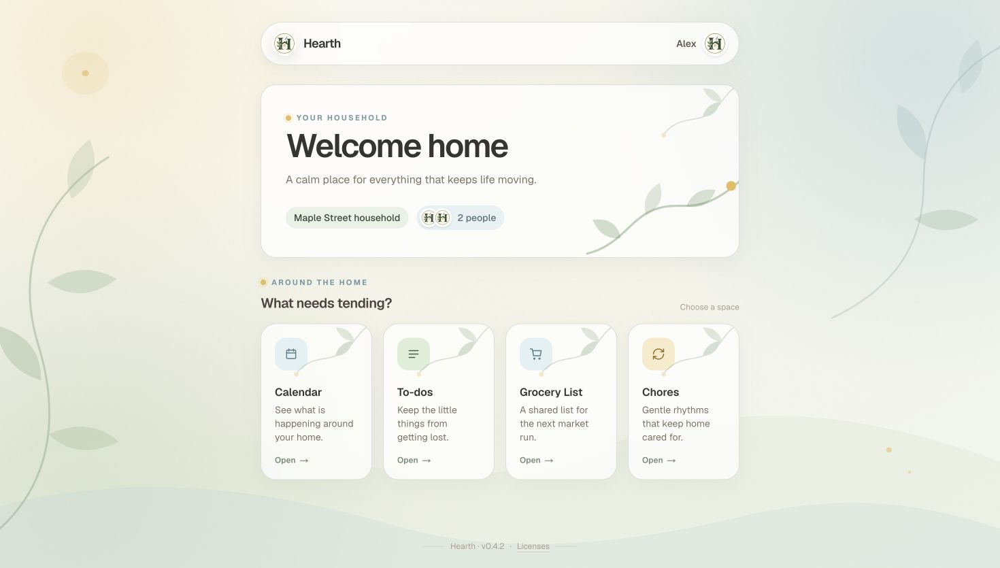
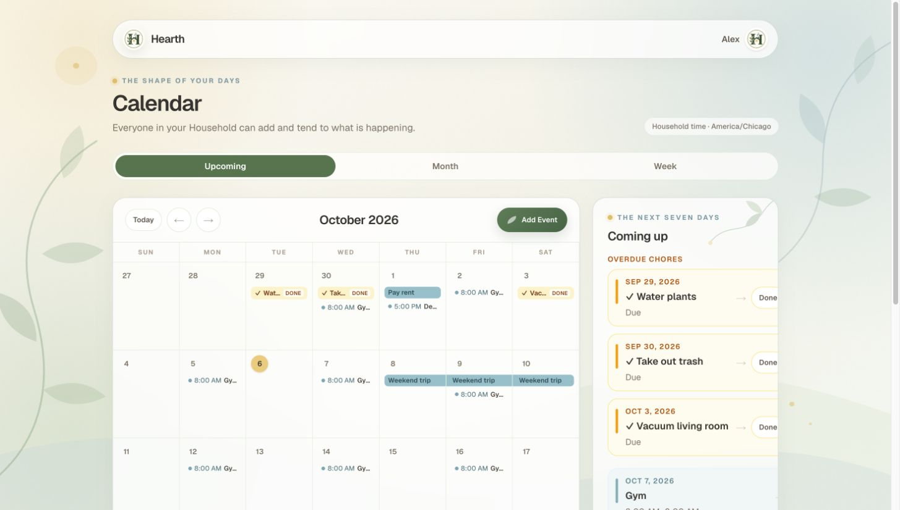
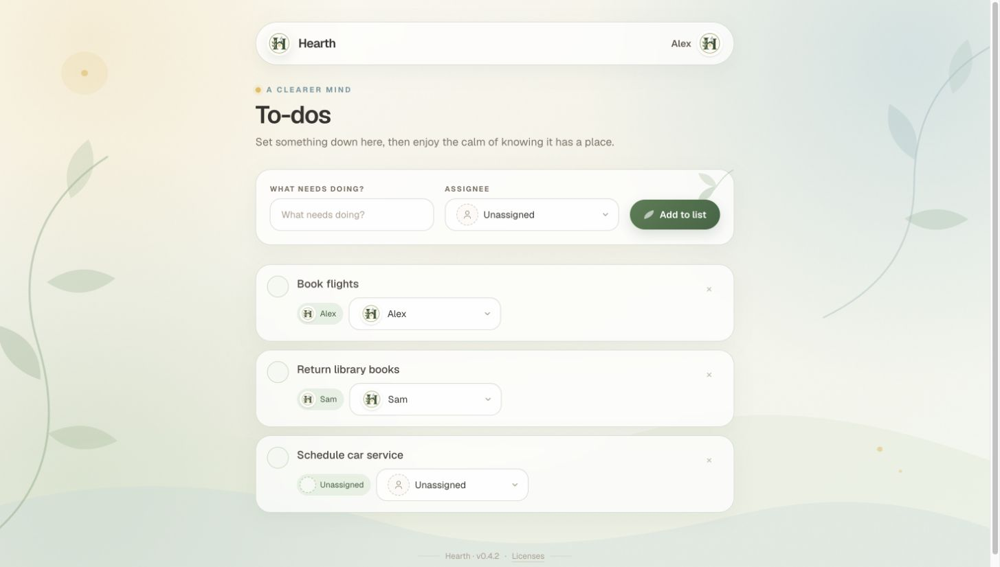
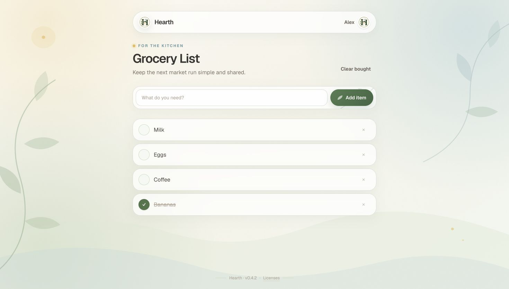
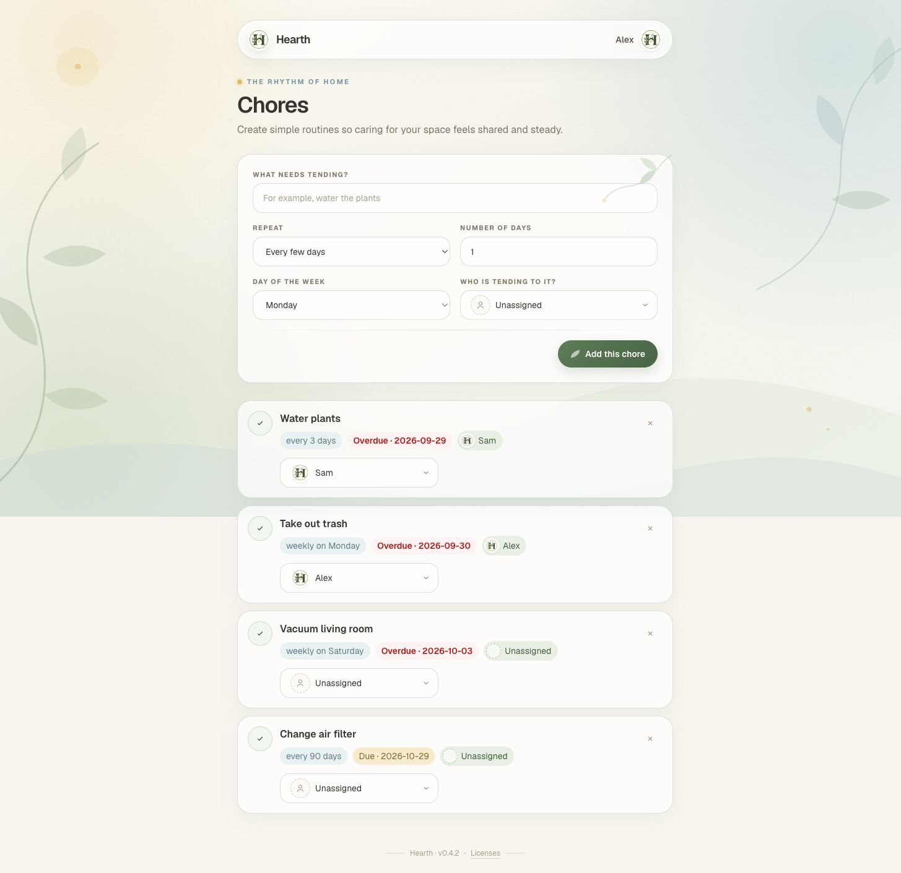
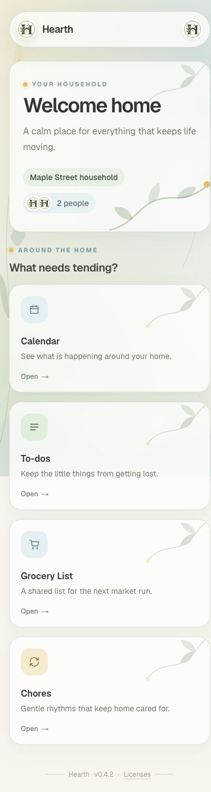

# Hearth

Hearth is a responsive household web app for coordinating a shared Calendar,
Chores, To-dos, and a Grocery List. It is a learning project built for one real
Household. The deployed app is limited to its existing Members; this repository
is intended for people who want to inspect the product and its implementation.

## What works today

| Area | Current behavior |
| --- | --- |
| Calendar | Upcoming, month, and week views; all-day and timed Events; Recurring Events with occurrence changes; due Chores; Household timezone |
| Chores | Every-N-days or weekly schedules, completion, next due date, and Member assignment |
| To-dos | Create, assign, complete, delete, and automatic cleanup of completed items |
| Grocery List | Add, mark bought, remove, and clear bought items |
| Household people | User Profiles and private Avatars, Memberships, Invite Codes, owner controls, and timezone settings |

Hearth is installable as a progressive web app. Meal planning, Notes, Messages,
Expenses, and Event Reminders are planned work; see the [roadmap](docs/ROADMAP.md).

## Access

The [deployed app](https://hearth-omega-umber.vercel.app) shows a sign-in page.
New account creation is disabled in Supabase Auth. Repository access does not
grant access to the private Household. The screenshots below use a fictional
Household in staging; they contain no production Household data.

## Screenshots





| To-dos | Grocery List |
| --- | --- |
|  |  |

| Chores | Phone layout |
| --- | --- |
|  |  |

## How it is built

The [Next.js App Router application](web/) uses TypeScript and Tailwind CSS.
Supabase provides Postgres, Auth, and private Avatar storage; Vercel hosts the
web app. A User belongs to a Household through a Membership. The Household is
the data boundary: application queries filter by `household_id`, and Postgres
row-level security independently enforces access.

For a typical edit, the screen submits to a Next.js Server Action. The action
loads the signed-in User and Household, writes through a user-scoped Supabase
client, and revalidates the affected page. Calendar recurrence rules and
occurrence changes live in the [Calendar library](web/lib/calendar.ts) and
ordered [SQL migrations](web/supabase/migrations/).

The [domain vocabulary](CONTEXT.md), [design records](docs/design/), and
[architecture decisions](docs/adr/) explain the model and trade-offs. The
[status](docs/STATUS.md) separates shipped work from active work.

## Run locally

Requirements: Node.js 24, Docker, and a local Supabase stack.

```bash
cd web
npm ci
npx supabase start
npx supabase status
```

The Supabase CLI applies the migrations and fictional [seed](web/supabase/seed.sql)
to the local stack. Create `web/.env.local` with the local API URL, publishable
key, and server-only service-role key reported by `npx supabase status`:

```dotenv
NEXT_PUBLIC_SUPABASE_URL=http://127.0.0.1:54321
NEXT_PUBLIC_SUPABASE_ANON_KEY=<local anon key>
SUPABASE_URL=http://127.0.0.1:54321
SUPABASE_SECRET_KEY=<local service-role key>
```

Then run `npm run dev` from `web/` and open <http://localhost:3000>.
Sign in to the local app as `alex@example.test` or `sam@example.test` with the
seed's local test password, `hearth-staging-demo`. Keep `.env.local` out of Git.
For verification, run `npm run lint`, `npm test`, `npm run build -- --webpack`,
and `npm run notices:check` from `web/`.

## Project layout

```text
web/app/                 routes and Server Actions
web/components/          shared UI
web/lib/                 auth, Calendar, recurrence, and data helpers
web/supabase/migrations/ ordered database changes
web/supabase/seed.sql     fictional local and CI data
docs/adr/                architecture decisions
docs/design/             feature designs
```

`dev` is the working branch. `master` is the production branch. CI checks the
application and rebuilds a fresh database from migrations and the seed; schema
changes go through staging before production. [CHANGELOG.md](CHANGELOG.md)
records shipped releases.
